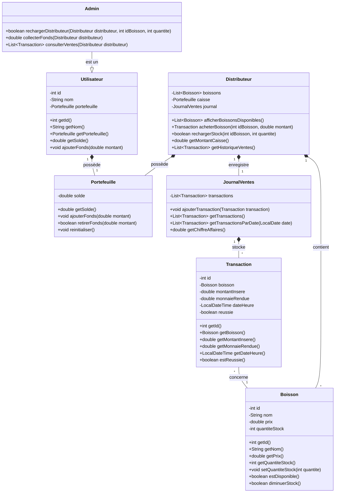

# Diagramme de Classes - Distributeur Automatique de Boissons

## Description des classes

### Distributeur

Cette classe représente le distributeur automatique de boissons. Elle gère la liste des boissons disponibles, les transactions d'achat et le rechargement du stock.

### Boisson

Cette classe représente une boisson disponible dans le distributeur. Elle contient les informations sur le nom, le prix et la quantité en stock de la boisson.

### Transaction

Cette classe représente une transaction d'achat. Elle enregistre les détails de la transaction, comme la boisson achetée, le montant inséré, la monnaie rendue et la date/heure de la transaction.

### Portefeuille

Cette classe gère les montants d'argent. Elle est utilisée à la fois pour la caisse du distributeur et pour le portefeuille de l'utilisateur.

### JournalVentes

Cette classe enregistre toutes les transactions effectuées par le distributeur. Elle permet de consulter l'historique des ventes et de calculer le chiffre d'affaires.

### Utilisateur

Cette classe représente un utilisateur du distributeur. Elle contient les informations sur l'utilisateur et son portefeuille.

### Admin

Cette classe représente un administrateur du système. Elle hérite de la classe Utilisateur et ajoute des fonctionnalités spécifiques comme le rechargement du distributeur et la collecte des fonds.
